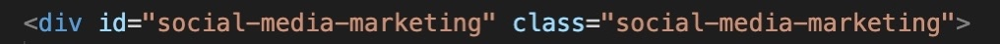

# Horiseon Task

In this task I was required to refactor existing code to meet a certain set of standard for a marketing agency who wanted to make their existing website more accessible.

## Criteria that I met to achieve this

### The use of semantic HTML elements.

**Before**

**After**

### Logically structured HTML elements that are independent of styling and positioning.

**Before**

**After**

### The icon and image elements all have accessible alt attributes.

**Before**

**After**

### The heading attributes fall in subsequential order

**Before**

**After**

### The title element is concise and descriptive

**Before**

**After**

## Deployed Application

[a link] (file:///Users/lisagunn/coding_bootcamp/week1/Horiseon-task/Develop/index.html)

